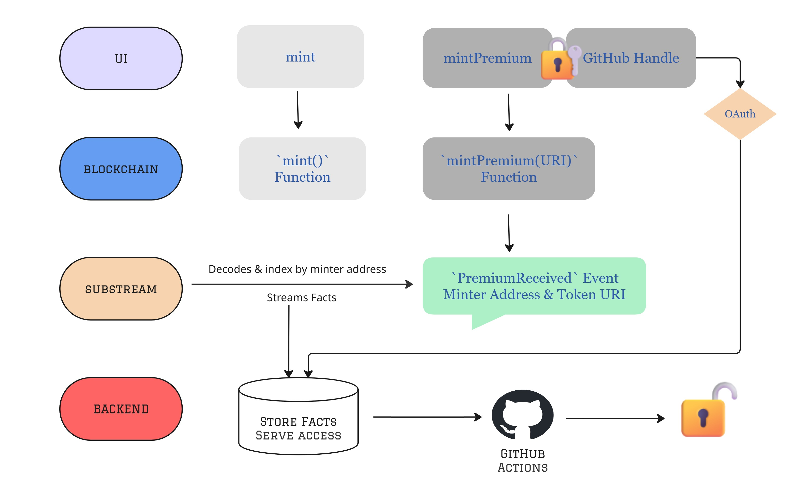

# Blog Articles – Web3 Gated Content

This repository is the web3 component of my portfolio, it consists of the `Blog` which is `ERC1155Upgradeable` contract with 2 NFTs:

 * A **Free NFT** for standard guides, articles, and tutorials. Developers can optionally donate to support the content.

 * A **Premium NFT** for premium tutorials to unlock code access covering advanced technical topics with full test cases.
 

### Logic Flowchart of Premium Tokens

* **In Frontend:** 

    * Developer provides his GitHub handle which will be stored server-side in JSON.
    
    * Mints the premium tutorial of his choice on my portfolio's blog.

* **In Blockchain:** 

    * `Blog` contract emits `PremiumReceived(address indexed sender, string tokenURI)` when `mintPremium(string calldata uri)` is invoked.

* **Substreams**

    * Decodes and indexes the event from blockchain and writes `substream-sink-file` to my backend containing: minter address, token uri, chain id, smart contract address, and tx hash.

* **Backend (Access Orchestrator)**

    * Listens to Substreams records, confirms finality, and authorizes the pair (minter address, tokenURI).

    * Maintains a minimal wallet → GitHub handle link (one-time).

    * For each authorized pair, it triggers the target repo’s GitHub Action to grant read access to that specific private repo.

* **GitHub Actions**
    * Each premium repo has a workflow that listens to
repository_dispatch: grant_access and adds the GitHub user as a collaborator (read) to that one repo.

    * The user receives a GitHub invite; once accepted, they can open the private repo for that tutorial.

<!--  -->
<!--  -->

   
  <em>Flowchart from mint → GitHub invite.</em>

### Reasons for implementing this logic

1. Avoids on-chain updates of each premium token’s URI (URIs are passed once at mint and enforced off-chain).
2. Saves gas versus on-chain proofs, like Merkle tress while keeping per-address + per-URI control in simple JSON.
3. Automates per-tutorial GitHub access via GitHub Actions, by inviting the mapped GitHub handle to the specific private repository referenced by tokenURI.

## Tools and Frameworks used 

- [Foundry](https://book.getfoundry.sh/)
- [Substreams from The Graph](https://thegraph.com/substreams/)
- [GitHub Actions](https://github.com/features/actions)
- [Slither](https://github.com/crytic/slither)
- [Slither GitHub](https://github.com/marketplace/actions/slither-action)
- [Mythril](https://github.com/ConsenSysDiligence/mythril)
- [Aderyn from Cyfrin](https://cyfrin.gitbook.io/cyfrin-docs/aderyn-cli/installation)
- [Certora](https://docs.certora.com/en/latest/docs/user-guide/install.html)

## Roadmap:

ERC-4337 (card/fiat → crypto) is on the roadmap.

